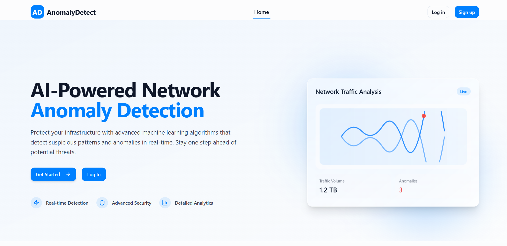
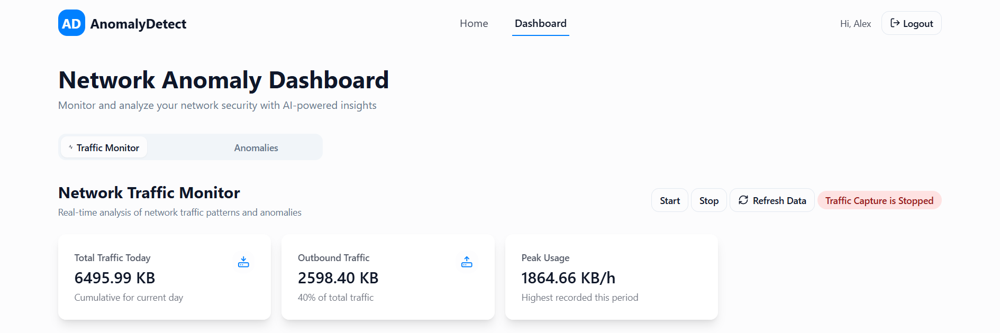
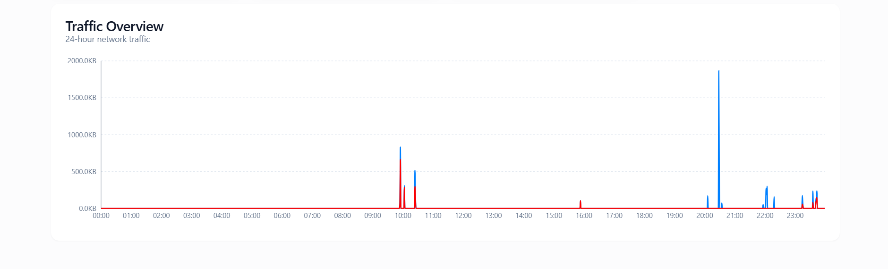

# AnomalyDetect Frontend

AI-powered web application for real-time network traffic analysis and anomaly detection using advanced machine learning algorithms. This frontend provides interactive dashboards, authentication, and live monitoring for network security insights.

## Features

- **Real-time Network Monitoring**: Visualize live network traffic and detect anomalies instantly.
- **AI-Powered Anomaly Detection**: Uses machine learning to identify suspicious patterns and security threats.
- **Interactive Dashboard**: Switch between traffic analytics and anomaly logs with detailed statistics.
- **Authentication**: Secure login and registration for user access control.
- **Responsive UI**: Modern, mobile-friendly design using Tailwind CSS and shadcn/ui components.
- **Custom Hooks**: Includes hooks for toast notifications and mobile detection.
- **Scalable & Secure**: Built with best practices for scalability and security.

## App Screenshots

Below are some screenshots of the application.







## Related Repositories

- **Backend:** [Anomaly-Detection-Backend](https://github.com/PDhvanik/Anomaly-Detection-Backend)
- **Model:** [Anomaly-detect-model](https://github.com/PDhvanik/Anomaly-detect-model)

## Project Structure

```
├── src/
│   ├── components/         # Reusable UI components (Navbar, Hero, Features, StatCard, etc.)
│   ├── pages/              # Main pages (Index, Dashboard, Login, Signup, NotFound)
│   ├── context/            # React context (AuthContext for authentication)
│   ├── hooks/              # Custom hooks (use-toast, use-mobile)
│   ├── lib/                # Utility functions
│   ├── App.tsx             # App entry point
│   └── main.tsx            # ReactDOM render
├── public/                 # Static assets
├── index.html              # HTML entry point
├── package.json            # Project metadata and scripts
├── tailwind.config.ts      # Tailwind CSS configuration
├── vite.config.ts          # Vite configuration
└── ...
```

## Main Pages & Components

- **Home (Index.tsx)**: Landing page with project overview and call-to-action.
- **Dashboard (Dashboard.tsx)**: Main authenticated area with tabs for:
  - **TrafficMonitor**: Real-time traffic visualization and statistics.
  - **AnomalyDetector**: List and filter detected anomalies, severity, and status.
- **Login/Signup**: Secure authentication forms with validation.
- **NotFound**: 404 error page for undefined routes.
- **Navbar**: Responsive navigation with authentication-aware links.
- **Features/Hero**: Highlights platform capabilities and value proposition.

## Prerequisites

- [Node.js](https://nodejs.org/) (v16+ recommended)
- [npm](https://www.npmjs.com/) or [bun](https://bun.sh/) (for dependency management)

## Getting Started

1. **Clone the repository:**

   ```sh
   git clone <repo-url>
   cd <project-directory>
   ```

2. **Install dependencies:**

   ```sh
   npm install
   # or
   bun install
   ```

3. **Start the development server:**

   ```sh
   npm run dev
   # or
   bun run dev
   ```

   The app will be available at [http://localhost:8080](http://localhost:8080).

4. **Build for production:**

   ```sh
   npm run build
   # or
   bun run build
   ```

5. **Preview production build:**
   ```sh
   npm run preview
   # or
   bun run preview
   ```

## Available Scripts

- `dev` : Start the Vite development server
- `build` : Build the app for production
- `preview` : Preview the production build
- `lint` : Run ESLint for code quality

## Tech Stack

- **React** + **TypeScript**
- **Vite** (fast dev/build tool)
- **Tailwind CSS** (utility-first styling)
- **shadcn/ui** (UI components)
- **Radix UI** (accessible primitives)
- **Recharts** (data visualization)
- **Zod** (form validation)

## Custom Hooks

- `useToast`: Toast notification system for user feedback
- `useIsMobile`: Detects mobile viewport for responsive UI

## Authentication

- User authentication is managed via React context (`AuthContext`).
- Credentials are stored in localStorage (for demo; replace with real API in production).
- Protected routes (Dashboard) require login.

## API Integration

- The frontend expects a backend API at `/api/results` for traffic and anomaly data.
- Proxy is configured in `vite.config.ts` to forward `/api` requests to `localhost:3000` (adjust as needed).

## License

MIT
